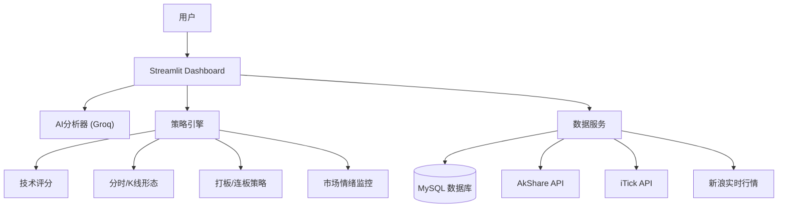

# 📈 LiangHuaFenXi - AI驱动的智能量化分析系统

[](https://opensource.org/licenses/MIT)
[](https://www.python.org/downloads/)
[](https://streamlit.io/)

LiangHuaFenXi 是一个结合了**传统技术分析**、**量化策略**和**大语言模型(LLM)**的智能股票分析系统。它不仅能提供实时的行情监控和技术指标分析，还能利用 AI (Groq) 生成类人化的交易策略建议。

> ⚠️ **风险提示**: 本项目仅供学习和研究使用，不构成任何投资建议。股市有风险，入市需谨慎。

---

## ✨ 核心亮点

*   **🤖 AI 智能投顾**: 集成 Groq LLM，模拟专业交易员视角，对盘面、技术指标、资金流向进行自然语言分析，给出明确的操作建议（买入/卖出/观望）及风控点位。
*   **📊 多维度信号聚合**: 独创的加权投票机制，整合 **CZSC (缠中说禅)**、**打板策略**、**动量策略**、**技术评分**等多种逻辑，输出高置信度的综合信号。
*   **⚡ 毫秒级实时监控**: 支持 Level 1/Level 2 行情接入，实时监控 5 档盘口、大单资金流向及分时异动（如W底、早盘急拉、量价背离）。
*   **💾 数据库深度集成**: 采用 MySQL 缓存历史数据，减少 API 请求；自动持久化 AI 分析历史，支持回溯复盘。
*   **🖥️ 现代化仪表盘**: 基于 Streamlit 的交互式 Dashboard，提供类似同花顺/通达信的专业级看盘体验。

---

## 🏗️ 系统架构



## 🚀 快速开始

### 1. 环境准备

确保已安装 Python 3.8+ 和 MySQL。

```bash
# 克隆仓库
git clone https://github.com/CaoCan888/LiangHuaFenXi.git
cd LiangHuaFenXi

# 安装依赖
pip install -r requirements.txt
```

### 2. 配置环境

复制 `.env.example` 为 `.env` 并填入配置：

```ini
# .env 文件
DB_HOST=your_mysql_host
DB_PORT=3306
DB_USER=your_username
DB_PASSWORD=your_password
DB_NAME=stock_analysis

GROQ_API_KEY=gsk_your_groq_api_key...
```

### 3. 初始化数据库

```bash
python main.py initdb
```

### 4. 启动系统

**方式一：启动可视化仪表盘 (推荐)**

```bash
run_dashboard.bat
# 或
streamlit run src/visualization/dashboard/app.py
```
浏览器访问 `http://localhost:8501`。

**方式二：命令行快速分析**

```bash
python quick_analyze.py
```

---

## 🛠️ 主要功能模块

### 1. 实时分析 Dashboard
- **K线图表**: 集成 Pyecharts，支持缩放、均线叠加。
- **实时盘口**: 5档买卖挂单、资金流向可视化。
- **信号面板**: 展示各策略的投票结果及置信度。
- **AI 报告**: 打字机效果实时输出 AI 的深度研判。
- **分析历史**: 查看过往的分析记录和准确率。

### 2. 策略引擎
- **Quick Analyze**: 单股多维度极速诊断。
- **Signal Aggregator**: 解决信号冲突，统筹多策略输出。
- **Intraday Pattern**: 盘中捕捉"高开低走"、"尾盘拉升"等关键形态。

### 3. 数据服务
- **Database Service**: 封装 MySQL 操作，实现数据缓存与历史存储。
- **Stock Collector**: 智能路由数据源 (Cache -> AkShare -> Baostock)。

---

## 📝 开发计划 (Roadmap)

- [x] 接入 Groq AI 进行自然语言分析
- [x] 实现数据库缓存层
- [x] 整合分时形态策略
- [x] 上线 Streamlit 仪表盘
- [ ] **Level 2 深度行情**: 利用 5 档盘口识别主力挂单意图 (In Progress)
- [ ] **AI 输出结构化**: 将 AI 建议转为 JSON 以支持自动交易
- [ ] **回测系统**: 基于历史数据的策略有效性验证

---

## 🤝 贡献指南

欢迎提交 Issue 和 Pull Request！

1. Fork 本仓库
2. 创建特性分支 (`git checkout -b feature/AmazingFeature`)
3. 提交更改 (`git commit -m 'Add some AmazingFeature'`)
4. 推送到分支 (`git push origin feature/AmazingFeature`)
5. 提交 Pull Request

## 📄 许可证

本项目基于 MIT 许可证开源。详情请参阅 [LICENSE](LICENSE) 文件。
